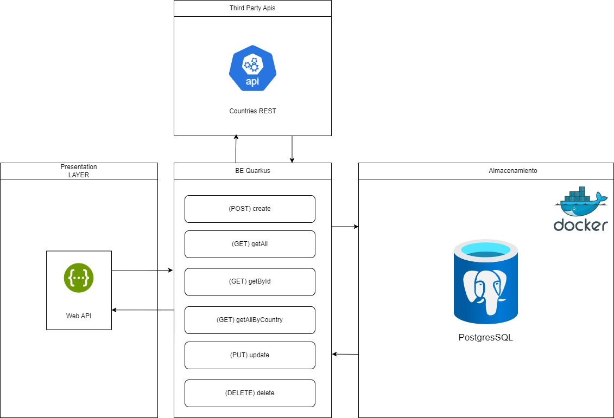

# **Gestión de Clientes - API RESTful**

## **Descripción**
Este proyecto proporciona una API RESTful para la gestión eficiente de clientes, permitiendo realizar operaciones CRUD (**Crear, Leer, Actualizar y Eliminar**) de manera rápida, segura y escalable. 

La API está diseñada para garantizar la integridad y disponibilidad de la información mediante el uso de **PostgreSQL** como base de datos y **Hibernate ORM con Panache** para el acceso a datos de manera eficiente. Además, se facilita el despliegue en entornos locales o de producción a través de **Docker y Docker Compose**.

---

## **Requisitos Previos**
Antes de ejecutar la aplicación, asegúrate de contar con las siguientes herramientas instaladas:

- **Java 17+**
- **Maven** (versión 3.8 o superior)
- **Docker y Docker Compose** (si deseas ejecutarlo en contenedores)

---

## **Diagrama de arquitectura**

---

## **Instalación y Uso**

### **1. Clonar el repositorio**  
```bash
git clone https://github.com/empresa/gestion-clientes.git
cd customer-crud-prueba-tecnica
```

### **2. Configurar las variables de entorno**
Edita el archivo `application.properties` para definir la configuración de la base de datos:

```properties
quarkus.datasource.db-kind=postgresql
quarkus.datasource.username=usuario
quarkus.datasource.password=clave
quarkus.datasource.jdbc.url=jdbc:postgresql://localhost:5432/basededatos
```

### **3. Ejecutar la aplicación en modo desarrollo**
```bash
./mvnw quarkus:dev
```
Este comando iniciará la aplicación en modo desarrollo con Quarkus.

### **4. Acceder a la documentación de la API (Swagger)**
Una vez iniciada la aplicación, puedes visualizar la documentación y probar los endpoints desde la interfaz Swagger UI:

```bash
http://localhost:8080/q/swagger-ui/
```

---

## **Ejecución con Docker**
Para levantar el entorno completo con Docker, ejecuta:

```bash
docker-compose up -d
```
---

## **Estructura del Proyecto**
El proyecto sigue una arquitectura modular y organizada:

```
customer-crud-prueba-tecnica/
│── src/
│   ├── main/
│   │   ├── docker/            # Configuración para Docker
│   │   ├── java/org/acme/
│   │   │   ├── dto/           # Data Transfer Objects
│   │   │   ├── entity/        # Entidades JPA
│   │   │   ├── exception/     # Manejo de excepciones
│   │   │   ├── mapper/        # Mapeo de entidades y DTOs
│   │   │   ├── repository/    # Acceso a la base de datos
│   │   │   ├── resource/      # Controladores REST
│   │   │   ├── service/       # Lógica de negocio
│   │   ├── resources/
│   │   │   ├── application.properties  # Configuración de Quarkus
│── test/                     # Pruebas unitarias y de integración
```

---

## **Endpoints Disponibles**
La API expone los siguientes endpoints para la gestión de clientes:

| Método  | Endpoint                                       | Descripción                          |
|---------|-----------------------------------------------|--------------------------------------|
| **GET** | `/api/customers`                             | Obtener la lista de todos los clientes |
| **GET** | `/api/customers/{id}`                        | Obtener los detalles de un cliente por su ID |
| **POST** | `/api/customers`                            | Crear un nuevo cliente |
| **PUT** | `/api/customers/{id}`                        | Actualizar la información de un cliente existente |
| **DELETE** | `/api/customers/{id}`                    | Eliminar un cliente |
| **GET** | `/api/customers/getCustomersByCountry/{country}` | Obtener clientes filtrados por país |

#### **Ejemplo de petición con `curl`**
```bash
curl -X GET http://localhost:8080/api/customers
```

#### **Ejemplo de petición con `Postman`**
1. Abre Postman y selecciona el método **GET**.
2. Introduce la URL: `http://localhost:8080/api/customers`
3. Haz clic en "Enviar" para ver los datos.

---

## **Pruebas Unitarias**
El proyecto incluye pruebas unitarias utilizando **JUnit 5 y Mockito**. Para ejecutarlas:

```bash
./mvnw test
```

---

## **Stack Tecnológico**
El proyecto se basa en las siguientes tecnologías:

- **Quarkus** (framework ligero y optimizado para Java)
- **Java 17+**
- **Maven** (gestor de dependencias)
- **Hibernate ORM con Panache** (manejo de persistencia)
- **RESTEasy con Jackson** (implementación de JAX-RS para servicios REST)
- **PostgreSQL** (base de datos relacional)
- **Docker & Docker Compose** (para contenedorización)
- **JUnit 5 y Mockito** (para pruebas unitarias)

---

## **Mejores Prácticas Implementadas**
- **Arquitectura basada en capas**, separando la lógica de negocio, persistencia y controladores.
- **Uso de DTOs y mapeo con MapStruct** para evitar exponer directamente entidades JPA.
- **Validaciones con Bean Validation (`@Valid`)** en los controladores para asegurar datos correctos.
- **Gestión centralizada de excepciones** para mejorar la respuesta de errores.
- **Configuración de seguridad** con Quarkus y JWT para autenticación (opcional).
- **Soporte para despliegue en Kubernetes** mediante configuraciones en `application.properties`.

---

## **Autores**
- **[@oscarballard](https://github.com/oscarballard)**

---
